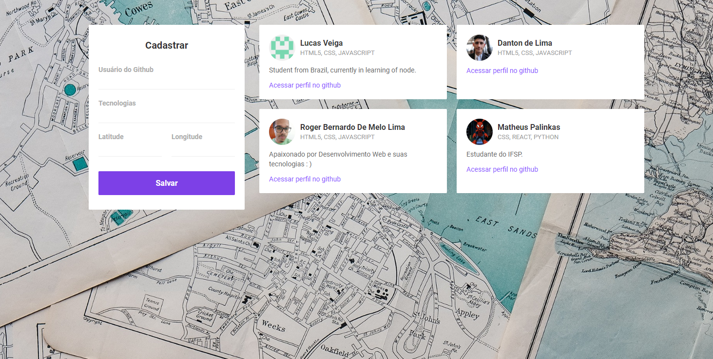

# Dev Radar
O objetivo deste projeto é aproximar devs de mesma stack próximos a você! Para tanto, usa-se a API do Github que fornece ao desenvolvedor dados como: nome de usuário, foto, bio e entre outras informações úteis e os serviços de geolocalização. 

## Iniciando
- Clone este projeto
- Instale todas as dependências (em cada módulo da aplicação: web, mobile, server)
- Inicie os módulos (comece pelo server)

## Rotas da aplicação
`GET: /devs`: Retorna todos os desenvolvedores cadastrados

`POST: /devs`: Cadastra um desenvolvedor

`GET: /search`: Procura desenvolvedores em uma determinada localização

## Screenshots

### Web

